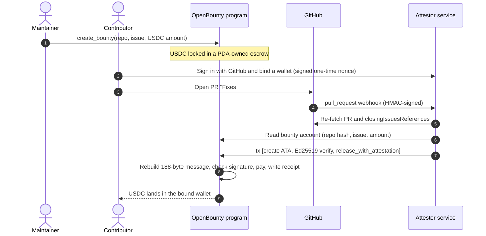

# OpenBounty

**Fund a GitHub issue with USDC. When the pull request that closes it is merged, the contributor is paid automatically.**
No manual payout, no custodian, no trust in the maintainer's memory.

**Live demo (Solana Devnet, demo data):** https://web-khaki-tau-97.vercel.app/console

   

---

## At a glance

- **What it is:** an escrow program plus an attestor service that turns "PR merged" on GitHub into "USDC paid" on Solana.
- **What works today:** the full loop on devnet, from funding an issue to a payout triggered by a real GitHub merge, with a public on-chain receipt. In the recorded run, PR #4 was merged at 00:46:18 UTC and the payout landed at 00:46:28 UTC, about 10 seconds later.
- **Why it can be trusted:** strict on-chain verification of every attestation, and every byte layout cross-checked between Rust, TypeScript and an independent Python derivation.
- **What it needs next:** a frontend, a security audit, and real users.

---

## The problem

Open-source bounties break at the last step: **getting paid**.

- Contributors do the work, then wait on a maintainer to remember, approve and send funds. Many never get paid.
- Maintainers who want to offer bounties either pay by hand or hand money to a custodial platform.
- Neither side can verify, in advance, that the money exists and will move when the work is merged.

## The solution

OpenBounty locks USDC in an on-chain escrow tied to a specific GitHub issue. A merged pull request that GitHub itself reports as closing that issue releases the funds to the author's wallet. Every payout is bound to exactly one bounty, one amount and one wallet, and is recorded in an on-chain receipt.

| Who | What they get |
|---|---|
| **Maintainer** | Fund an issue once. Funds are visible and locked on-chain. Unclaimed funds are refundable after the deadline plus a grace period. |
| **Contributor** | Proof the money is escrowed before starting. Instant USDC payout on merge, to a wallet they proved they own. |
| **Anyone** | Every bounty, receipt and payout is public and verifiable on Solana. |

## How it works



The program never trusts the caller. It does not read GitHub. Instead, an **attestor** signs a fixed 188-byte statement ("this PR merged, closed this issue, author is GitHub user X, pay wallet W this amount"), and the program verifies that signature through Solana's native Ed25519 precompile and checks the statement against its own on-chain state.

### The attestation (MergeAttestationV1, 188 bytes, Borsh, little-endian)

| Field | Size | Source of truth |
|---|---|---|
| `domain` = SHA-256("OPENBOUNTY_MERGE_ATTESTATION_V1") | 32 | constant, prevents cross-protocol replay |
| `bounty` | 32 | bounty PDA |
| `repo_hash` = SHA-256(lowercase `owner/repo`) | 32 | on-chain bounty |
| `issue_number` | 8 | on-chain bounty |
| `pr_number` | 8 | GitHub |
| `commit_sha` (raw 20 bytes, not hex) | 20 | GitHub |
| `github_user_id` | 8 | GitHub (PR author) |
| `payout_wallet` | 32 | wallet bound to that GitHub user |
| `amount_base_units` | 8 | on-chain bounty |
| `merge_timestamp` | 8 | GitHub |

## Live on Solana devnet

Everything below was produced by the real program and the real backend, including a payout triggered by an actual GitHub merge.

| Item | Link |
|---|---|
| Program | [`DNLHZMdnmgxpWWYbqdNcp5xLqvyJ6zxonn27qUAveGch`](https://explorer.solana.com/address/DNLHZMdnmgxpWWYbqdNcp5xLqvyJ6zxonn27qUAveGch?cluster=devnet) |
| Deploy transaction | [`5cvJMRc3…2DWj`](https://explorer.solana.com/tx/5cvJMRc3APefTt3oF7L7LBogdoL2PSNx8VrjqJHSN1dRsdUxSLY7nGpJWVgQxixrwgiiYjVphJMe252hv5Ur2DWj?cluster=devnet) |
| Config PDA | [`6vsgNZps…tpKp`](https://explorer.solana.com/address/6vsgNZpsM4YoxGg2dbUh7U251Qbqqf6ht8ucs8mNtpKp?cluster=devnet) |
| Attestor public key | [`DQstviVN…UHcPa`](https://explorer.solana.com/address/DQstviVNCyFMKRFZiuN3JroRChooeM2wDbpKheUUHcPa?cluster=devnet) |
| Test USDC mint (6 decimals) | [`85EeiBHg…ey5F`](https://explorer.solana.com/address/85EeiBHg8K68RsMpV2Yz36K7qu7uKQh1PtRjZ61iey5F?cluster=devnet) |
| Bounty for issue #3 (10 USDC) | [`9FuyjLaE…a1bsF`](https://explorer.solana.com/address/9FuyjLaEJeBVrfHi4BL4xLjmQBsAcD1ve8RrkADa1bsF?cluster=devnet) · [create tx](https://explorer.solana.com/tx/3ZSoaWE4xazsNumPahD2c8oXnHummXTapBZDg6qdMNbWEbAUtCMbYcGWjukHr5tSLpw2xk7TVz4NE9tzaMYavtxm?cluster=devnet) |
| Payout triggered by merging [PR #4](https://github.com/ankittiwari-04/open-bounty/pull/4) | [`2rW3NupDR2KugPA86qfHbRFX6Dii9iKSzXzwj5yTXxFmnZA4mhREf7P1VhpAYuLpZxvqieRPqbNGdKVRajeZLcv1`](https://explorer.solana.com/tx/2rW3NupDR2KugPA86qfHbRFX6Dii9iKSzXzwj5yTXxFmnZA4mhREf7P1VhpAYuLpZxvqieRPqbNGdKVRajeZLcv1?cluster=devnet) |
| Earlier attested release to a fresh wallet (e2e script) | [`4N4Uzi2b…m6eH`](https://explorer.solana.com/tx/4N4Uzi2b6nJEM7i9tTx1ehZKxtmL1ANLCEipHxUFTW1tKHs3MLxUEpnTtNyJzwH67gXy8DrLDWncUkzTzuhym6eH?cluster=devnet) |


## Security model

### What the on-chain program enforces

- **Exact-message binding.** The program rebuilds the expected 188-byte message from its own state and the instruction arguments, and requires the signed message to match byte for byte. Changing the amount, wallet, issue, repo or PR invalidates the signature.
- **Strict Ed25519 verification.** The verify instruction must sit *immediately before* `release_with_attestation`, contain exactly one signature, be signed by the configured attestor key, and use self-contained offsets. Index-spoofing attempts (signature, public key and message index pointing elsewhere) are rejected with a dedicated error, and a control test proves those tests fail for the right reason.
- **No double payout.** A receipt PDA is created per bounty. A second release cannot initialize it, and a paid bounty cannot be refunded.
- **Destination is fixed by the signature.** The payout wallet is inside the signed message, and the destination token account must be that wallet's associated token account.
- **Amount, deadline, pause and caps.** Amount must equal the escrowed amount, the merge must be at or before the deadline, a global pause flag blocks creation and release, and a configurable cap limits bounty size.
- **Refunds.** Only the maintainer can refund, and only after the deadline plus a grace period.

### What the backend adds

- GitHub webhooks are accepted only with a valid HMAC-SHA-256 signature over the raw body, compared in constant time.
- The webhook is a trigger, not a source of truth. The service re-fetches the PR from GitHub, checks it is merged into the expected branch, and uses GitHub's `closingIssuesReferences` (not text in the PR description) to decide which issue it closes.
- Bounty state (amount, repo, issue, deadline, status) is read from the chain, and the bounty address is re-derived from its own fields before use.
- The payout wallet comes only from a **wallet binding**: the GitHub user signs in, the server issues a one-time nonce, and the wallet signs a message containing the GitHub ID and nonce. Nonces expire in 5 minutes and are burned on any attempt.
- Submission is idempotent: if the receipt PDA exists, nothing is sent. Duplicate webhooks for the same PR are skipped while one is in flight.

### Trust assumptions (stated plainly)

The attestor is a trusted role. If its key were compromised, an attacker could sign a release for any *funded* bounty to a wallet of their choice. Today this is limited by the per-bounty cap and the program checks above, but it is the main risk in the design. See the roadmap for threshold attestation and key custody. The code is **unaudited** and runs on devnet with a test token.

## Testing

| Layer | What is covered |
|---|---|
| Rust (LiteSVM against the compiled `.so`), 58 tests | Release security (wrong attestor, wrong domain, wrong repo, wrong issue, wrong bounty, amount mismatch, redirected payout, late merge, missing or misplaced Ed25519 instruction), Ed25519 spoofing, lifecycle, pause, refund timing, config |
| TypeScript, 94 tests | Serializer, signer, transaction builder, GitHub verification, discovery, wallet binding, sessions and OAuth, SQLite store, submitter, HTTP server |
| Cross-language golden vectors | The 188-byte attestation, the release instruction data, the Ed25519 instruction, and the on-chain account layout are each computed independently in Rust (and Python for the message) and must match TypeScript byte for byte |
| End to end | A transaction **built by the TypeScript backend** executes successfully against the real compiled program, and the same flow runs on devnet |

## Repository layout

```
programs/open-bounty/   Anchor program (create_bounty, release_with_attestation, refund_expired, initialize_config)
  tests/                LiteSVM tests, golden vectors, TypeScript end-to-end test
backend/src/
  attestation.ts        188-byte serializer (bigint, range-checked)
  signer.ts, tx.ts      Ed25519 signing and [create ATA, Ed25519, release] builder
  github.ts             PR re-verification, GraphQL closing-issue check
  attestor.ts, release.ts, pipeline.ts, submit.ts   attestation, release flow, idempotent submit
  binding.ts, session.ts, oauth.ts, store.ts        wallet binding, sessions, GitHub OAuth, SQLite
  server.ts, main.ts    HTTP server and entrypoint
  devnet-*.ts           devnet setup and demo scripts
```

## Run it locally

Requirements: Rust, Solana CLI (with `cargo build-sbf`), Node 22.5 or newer.

```bash
# 1. Build the program. The Rust tests load target/deploy/open_bounty.so,
#    so build with cargo build-sbf.
cargo build-sbf --manifest-path programs/open-bounty/Cargo.toml --sbf-out-dir target/deploy
cargo test -p open-bounty

# 2. Backend tests
cd backend && npm install && npm test && npm run typecheck

# 3. Devnet: create config + test mint, then run an attested payout
node --import tsx src/devnet-setup.ts
node --import tsx src/devnet-e2e.ts
```

To run the server, copy the variables below into `backend/.env` (never commit it) and run `node --env-file=.env --import tsx src/main.ts`.

| Variable | Purpose |
|---|---|
| `RPC_URL`, `PROGRAM_ID` | Solana RPC and the deployed program |
| `WEBHOOK_SECRET` | Shared secret for the GitHub webhook |
| `GITHUB_TOKEN` | Fine-grained token, read-only on Pull requests and Issues |
| `EXPECTED_BASE_REF` | Only PRs merged into this branch qualify (the repo's default branch) |
| `ATTESTOR_KEYPAIR_PATH`, `PAYER_KEYPAIR_PATH` | Attestor signing key (must equal the on-chain config) and fee payer |
| `SESSION_SECRET`, `GITHUB_CLIENT_ID`, `GITHUB_CLIENT_SECRET`, `OAUTH_REDIRECT_URI` | GitHub sign-in (optional; all four needed to enable it) |
| `DB_PATH` | SQLite file for wallet bindings |

`DEV_INSECURE_SESSION=1` trusts a request header for the GitHub ID. It exists only for local testing and must never be set in production.

Webhook setup: add a webhook to the repo with payload URL `<your-url>/webhook/github`, content type `application/json`, the same secret, and only the **Pull requests** event. Open a PR into the default branch with `Fixes #N` in the description.

## Why Solana, and who this is for

- **Cents-level fees make small bounties viable.** A $5 fix is not worth it on a chain where the fee is a meaningful share of the payout.
- **USDC-native settlement** means contributors get a dollar-denominated payout they can use immediately.
- **PDAs, the Ed25519 precompile and the instructions sysvar** let the program verify an off-chain attestation without custody or a trusted payout button.
- **Onboarding.** Every contributor who claims a bounty creates and binds a Solana wallet, so the product brings open-source developers into the ecosystem as a side effect of doing their normal work.

Target users are open-source maintainers and DAOs that want to pay for specific issues, and contributors worldwide who want predictable payment.

## Fit with the judging criteria (Superteam India x Colosseum)

| Criterion | How OpenBounty addresses it |
|---|---|
| **Ecosystem impact** | Reusable infrastructure: a pattern for turning an off-chain event (a GitHub merge) into an Ed25519-verified, replay-protected on-chain payout, with no custody and a public receipt. USDC settlement on Solana. |
| **Product-market fit** | A defined problem (contributors and maintainers cannot trust bounty payment) and defined users (open-source maintainers and DAOs funding specific issues, and the contributors who fix them). Early usage is reported honestly in the Traction section. |
| **Growth potential** | Every claimed bounty creates and binds a Solana wallet for a developer who may be new to the ecosystem. Bounties live in GitHub issues, so each funded issue is visible distribution to other contributors. |

## Roadmap

1. Frontend for creating bounties, signing in with GitHub, binding a wallet and tracking status.
2. Replace the per-repo webhook with a GitHub App for one-click installs.
3. Threshold (multi-attestor) signing and key custody in a KMS or HSM, to remove the single-key risk.
4. Third-party security audit, then mainnet with a conservative cap.
5. Multisig maintainers (Squads), additional SPL tokens, partial and milestone payouts, and contributor reputation.
6. Pilot with Solana ecosystem repositories.

## Status and limitations

- Devnet only, test USDC, unaudited.
- Wallet bindings are stored in SQLite on a single server; there is no replication yet.
- Pending binding nonces are held in memory and are lost on restart (users simply request a new one).

## Traction

`<Add real numbers here: repos or maintainers contacted, pilots, funded bounties, feedback. Delete this section if there is nothing to report yet.>`

## License

MIT. See `LICENSE`.
